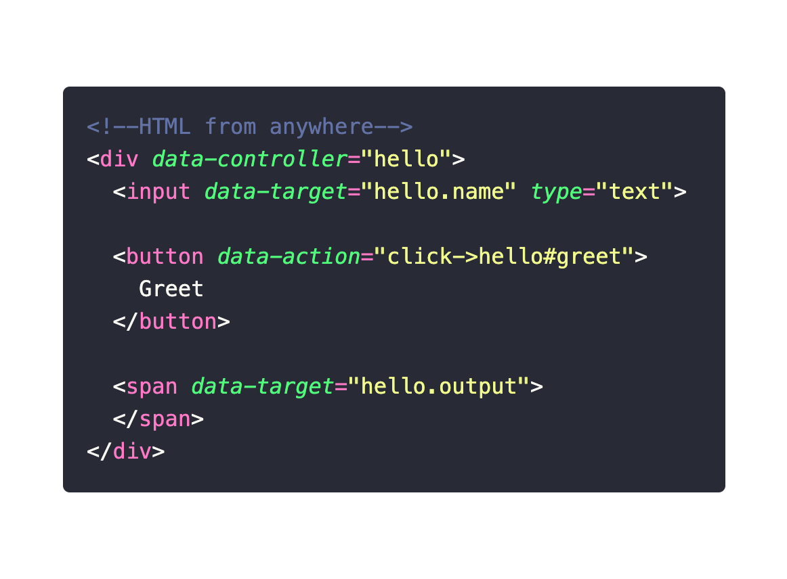

autoscale: true
## Stimulus Reflex

#### **StimulusJS + Websockets (and friends)**

^
- Familar for people that have seen phoenix live view

---


---

Use StimulusReflex to stream page updates using websockets to the browser without writing an JS[^1]


[^1]: Well almost

---

## Break it down

---

## Break it down - **StimulusJS** 



^
- Stimulus JS describes itself as having modest ambitions written by the folks at Basecamp
- DHH - "sprinkling javascript around" on a page to augment the html and this turned into Stimulus JS
- A different approach to ReactJS which takes a much more hands on approach to manipulating the content of a webpage

---


`data-action="click->hello#greet"`
`data-target="hello.name"`
`data-target="hello.output"`

^
- Familiar concept of controllers
- Used to encapsulate pieces of front end functionality
- don't need one per page

---


---
## Break it down - **Reflex**
#### Websockets

Keeps the browser and the server connected allowing the server and browser to communicate over a full-duplex tcp connection


^
This is where the magic happens.
- Traditional client server interaction often, browser makes some request to server, server responds to request, end of story
- Websockets allow for

---
## Break it down - **Reflex**
#### ActionCable

The plumbing that allows rails to communicate with websockets

---

## Break it down - **Reflex**
#### CableReady

The gem used to trigger client-side DOM changes from server-side Ruby.

^
- last piece of puzzle
- Triggers DOM changes across the websocket connection

---

## Put them all together


^
Putting that all together and you get stimulus reflex, by using the stimulusjs library "sprinkles" in the front end, and action cable and cable ready on the back end. We can create a reactive web page using mainly ruby which I think is pretty damn neat. I'll show you what that looks like in a moment

---

## Yeah, but why?


^
- Now that we can manage our front end from our back end, we now have significantly less client side state to manage
- I'm much better at ruby than I am at JS, this allows me to make a reactive webpage without having to go down the JS rabbit whole
- I just love the idea of streaming the updates to my webapps with everything coming from the back end in my head it feels much simpler to reason about all the bits and pieces

---

## Core Concepts
#### (Comes in 2 flavours 🍨)

---

## Core Concepts
#### Look ma, no controllers

1. HTML data attributes
2. Server side Reflex Object

---

## HTML data attributes


The `data-syntax` attribute format `[DOM-event]->[ReflexClass]#[action]`

---

## Server side Reflex Object

*[DOM-event]->[ReflexClass]#[action]*
`click->Counter#increment`


^
- No controller needed
- Instance variables shared
- Flow through to view

---

## Server side Reflex Object

`data-step="1"`

`data-count="<%= @count.to_i %>`


---

## Core Concepts
#### Less Magic 🧙‍♂️

1. HTML data attributes
2. Client side StimulusReflex controller
3. Server side Reflex Object
4. Server side controller

---

## HTML data attributes


---

## Client side StimulusReflex controller


`[ServerSideClass]#[action]`

^
- Similar syntax to `data-syntax` attribute in the "no controller" example
- Must use stimulate to call reflex actions

---

## Server side Reflex Object


^
- using session in lieu of persistence

---

## Server side controller


---

## Diving in - Live coding time 🤞

---

## Getting Setup

```bash
rails new todo-example --webpack=stimulus
cd todo-example
bundle add stimulus_reflex
bundle exec rails stimulus_reflex:install
rails db:create
```

---

## Handy Tools
### *Things I found on my adventure*

Polacode extension - Code screenshots
https://newcss.net/ - Classless CSS

---

# That is all folks 🙇
