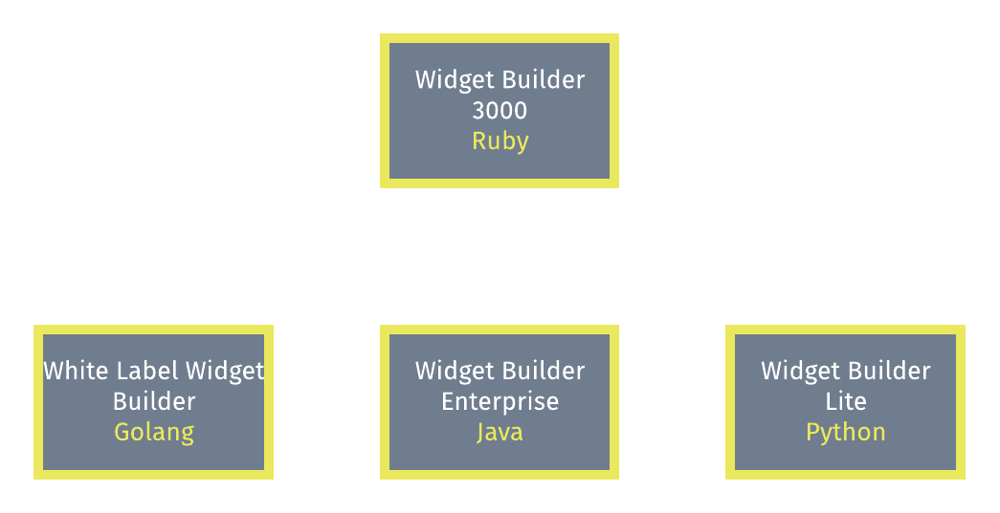
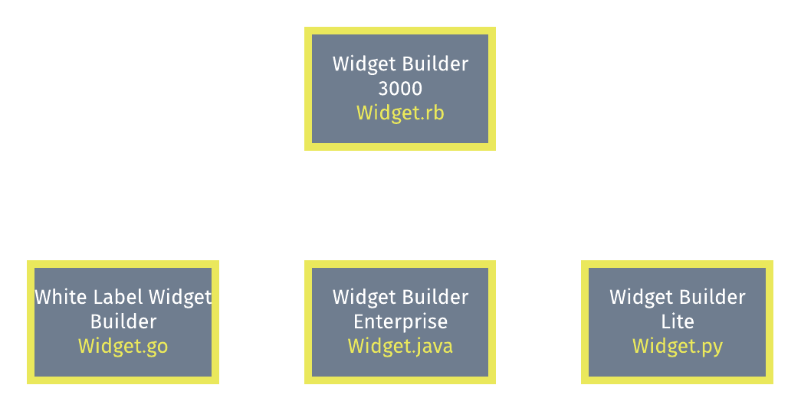
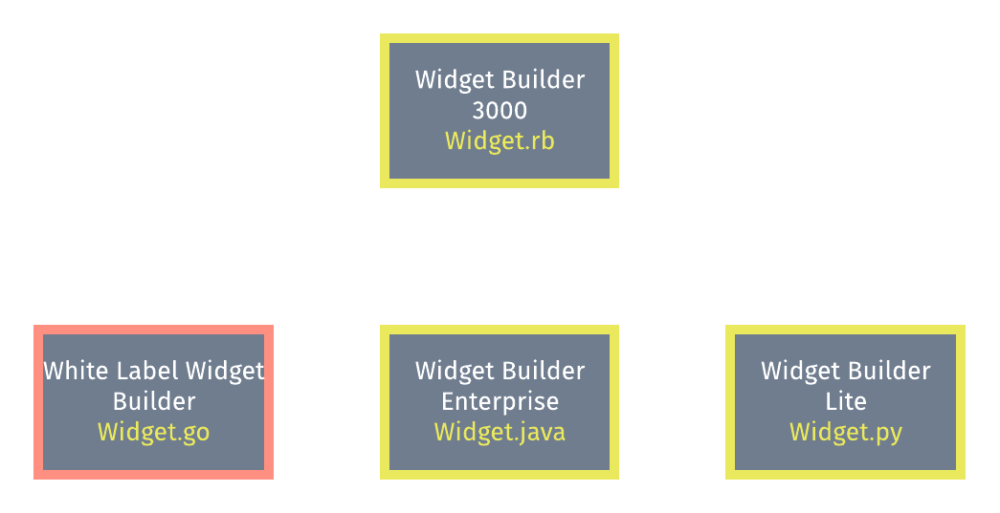
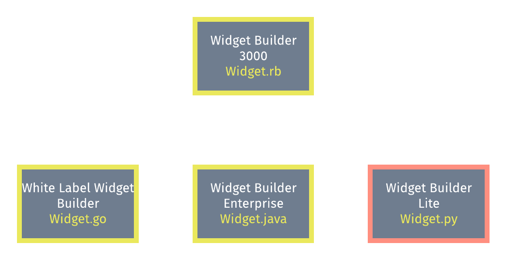
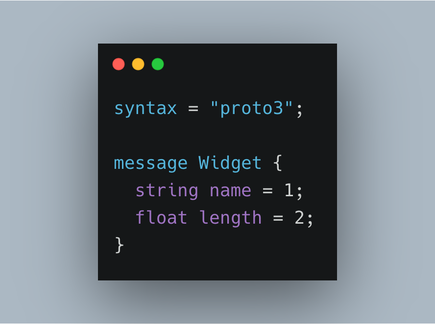
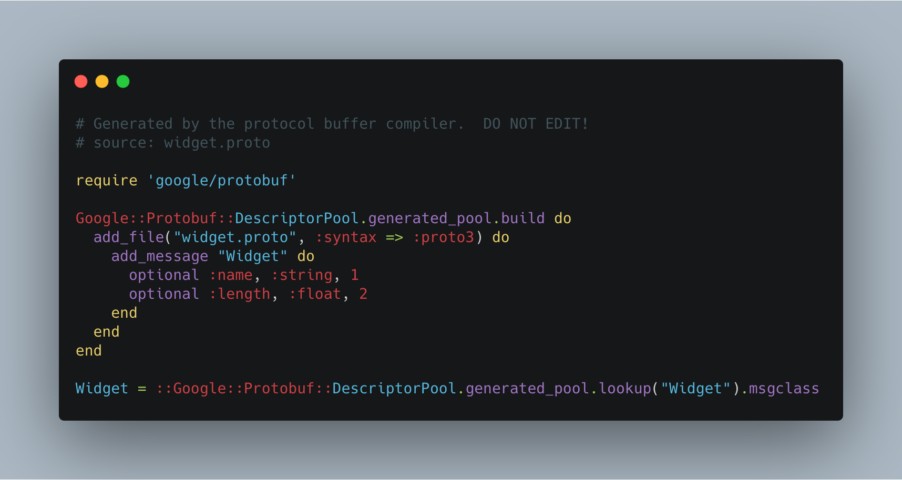
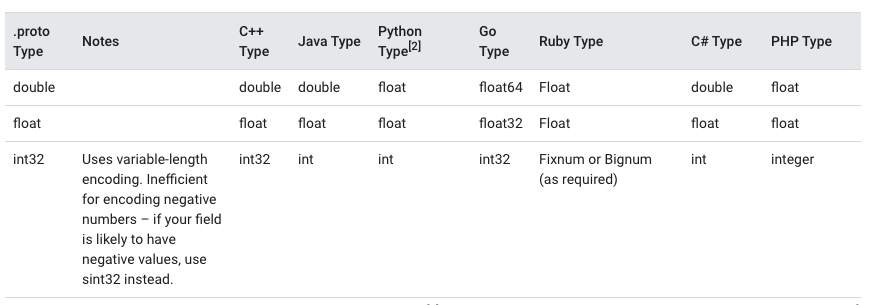

# Protobufs
## for Beginners
### **by a beginner**

^
- Not an expert
- Started using at work
- Thought I'd attempt to explain what I've learnt so far

---

# What?

<br>

>> **a language-neutral, platform-neutral, extensible way of serializing structured data.**
-- Google

^
- Definition by google
- Unpack this later

---

# What? v2.0.0

<br>

>> **A standardized way of structuring information across different languages.**
-- Mat

^
- The definition I attempted to make, leaves a lot to be desired
- Focus on a single thing
- lets keep going.

---

# Setting the stage



**Company**: Global Widgets Incorporated

**Developer**: Wally

**Problem(s)\***: Several languages across several services

<sub>*Of which there are a few</sub>

^
- The finest widget makers in all the land, some say 20 widgets per second, on a good day
- Wally just started
- Previous CTO couldn't decide which language he liked
- Challenge to keep things in sync

---




^
- It's a warm summers Tuesday
- Wally is optimizing widget throughput for optimum partner synergy
- CEO tells Wally that widgets have a new requirement: they now have a length
- Wally decides to represent the length as a float
- Wally now needs to change all the services to take into account


---




^
- He's getting a bunch of pressure and accidentally updates the go app to store the length as an int (oh the loss of precision)


---




^
- After finally debugging the loss of precision problem he forgets to add the new field to the widget model in the widget builder lite and spends more time debugging

---



`widget.proto`

^
Protobuf example
Proto version
a message
give it some attributes
behaves like a poro you'd use to store data
protobuf language
We can start to use types


---



[.code-highlight: 1]
[.code-highlight: 2]

```
protoc --ruby_out=./ widget.proto
CreatePresentationRequest.new(title: "Protobufs For Experts", speaker_name: ["Mat"], length_of_talk: 60)
```


^
  - this is the output
  - See CreatePresentationRequest PORO
  - Protobuf Types all map to an equivalent type in ruby or other languages
  - Now that we have types, I'll get a type error if I try and pass the wrong type to CreatePresentationRequest constructor

---

### But why, you ask?

[.code-highlight: none]
[.code-highlight: 1-2]
[.code-highlight: 1-4]
[.code-highlight: 1-6]
[.code-highlight: all]

<br>

```
protoc --ruby_out=./ widget.proto

protoc --java_out=./ widget.proto

protoc --csharp_out=./ widget.proto

protoc --python_out=./ widget.proto

protoc --ruby_out=./ widget.proto --java_out=./ widget.proto --csharp_out=./ widget.proto --python_out=./ widget.proto
```

^
But why you ask?
- As you saw with the previous command we can now generate these models for ruby
- But we can do it for several other languages as well
- In this way,

---


`widget.proto`

^
We can now have a single place to view the contracts we're using between each service
without having to manage changing each services classes manually.


---

# We got types!



^
We can define one type in our proto file and that will generate


---

### Bits and Pieces

**More info for protocol buffers**
https://developers.google.com/protocol-buffers/
<br>

**Languages supported by Google**
C++, C#, Dart, Go, Java, Python

**Plus some community plugins to support**
JS, TS and I imagine a bunch more.

^
- Mention gRPC and how it uses that.
- slide ideas
- Talk about grpc a bit
- talk about google and where to find more bits
- last slide have "wheres wally" in lots of different languages
- also add wally into more slides

---

### Thanks all!


